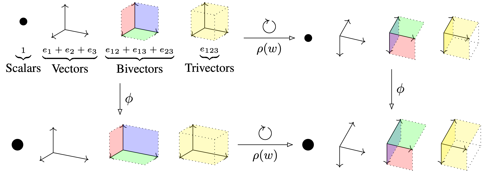

# [Clifford Group Equivariant Networks (NeurIPS 2023 Oral)](https://arxiv.org/abs/2305.11141)


**Authors:** David Ruhe, Johannes Brandstetter, Patrick Forré

<ul>
<li>
<a href="https://arxiv.org/abs/2305.11141">
    <strong>Paper Link: </strong> 
</a>
</li>
<li>
<a href="https://colab.research.google.com/drive/1Lwxn11gLBtUkNU9s0DV3QgFFedNjFBl3?usp=sharing">
    <strong>Google Colaboratory Tutorial:</strong> 
</a>
</li>
<li>
<a href="https://davidruhe.github.io/2023/06/14/clifford-group.html">
    <strong>Blog Post Series C2C:</strong> 
</a>
</li>
</ul>

## Abstract
We introduce Clifford Group Equivariant Neural Networks: a novel approach for constructing $\mathrm{O}(n)$- and $\mathrm{E}(n)$-equivariant models.
We identify and study the *Clifford group*, a subgroup inside the Clifford algebra whose definition we adjust to achieve several favorable properties.
Primarily, the group's action forms an orthogonal automorphism that extends beyond the typical vector space to the entire Clifford algebra while respecting the multivector grading. This leads to several non-equivalent subrepresentations corresponding to the multivector decomposition. 
Furthermore, we prove that the action respects not just the vector space structure of the Clifford algebra but also its multiplicative structure, i.e., the geometric product.
These findings imply that every polynomial in multivectors, 
including their grade projections, 
constitutes an equivariant map with respect to the Clifford group, allowing us to parameterize equivariant neural network layers.
An advantage worth mentioning is that we obtain expressive layers that can elegantly generalize to inner-product spaces of any dimension.
We demonstrate, notably from a single core implementation, state-of-the-art performance on several distinct tasks, including a three-dimensional $n$-body experiment, a four-dimensional Lorentz-equivariant high-energy physics experiment, and a five-dimensional convex hull experiment.

## Requirements and Installation

- Python 3.10.8
- torch 1.13.1+cu116
- PyYAML 6.0
- scikit-learn 1.2.2
- h5py 3.8.0
- tqdm 4.65.0

## Tutorial
Check `notebooks/tutorial.ipynb` for a tiny introduction to the Clifford equivariant layers.
There's also a tutorial given at [](https://colab.research.google.com/drive/1Lwxn11gLBtUkNU9s0DV3QgFFedNjFBl3?usp=sharing).


## Code Organization

- `algebra/`: Contains the Clifford algebra implementation.
- `configs/`: Contains the configuration files.
- `data/`: Contains the data loading scripts.
- `engineer/`: Contains the training and evaluation scripts.
- `models/`: Contains model and layer implementations.
- `notebooks/`: Contains the tutorial notebook.

## Usage and Datasets

Set a DATAROOT environment variable.
E.g., `export DATAROOT=./datasets/ `

For the signed volumes and convex hull experiments, run `data/o3.py` to generate the data.
For the $n$-body experiment, generate the data using, e.g., the [EGNN repository](https://github.com/vgsatorras/egnn).
For the top tagging experiment, download the data using instructions from the [LorentzNet repository](https://github.com/sdogsq/LorentzNet-release).


### O(3) Experiment: Signed Volumes
```python o3.py -C configs/engineer/trainer.yaml -C configs/optimizer/adam.yaml -C configs/dataset/o3.yaml -C configs/model/o3_cgmlp.yaml --trainer.max_steps=131072 --trainer.val_check_interval=1024 --dataset.batch_size=128 --dataset.num_samples=65536 --model.hidden_features=96 --model.num_layers=4 --optimizer.lr=0.001```


### O(5) Experiment: Convex Hulls
```python hulls.py -C configs/engineer/trainer.yaml -C configs/optimizer/adam.yaml -C configs/dataset/hulls.yaml -C configs/model/hulls_cgmlp.yaml --trainer.max_steps=131072 --trainer.val_check_interval=1024 --dataset.batch_size=128 --dataset.num_samples=65536 --model.hidden_features=32 --model.num_layers=4 --optimizer.lr=0.001```

### O(5) Experiment: Regression
```python o5_regression.py -C configs/engineer/trainer.yaml -C configs/optimizer/adam.yaml -C configs/dataset/o5_regression.yaml -C configs/model/o5_cgmlp.yaml --trainer.max_steps=131072 --trainer.val_check_interval=1024 --dataset.batch_size=32 --dataset.num_samples=50000 --optimizer.lr=0.001```

### O(3) Experiment: $n$-body.
```python nbody.py -C configs/engineer/trainer.yaml -C configs/optimizer/adam.yaml -C configs/dataset/nbody.yaml -C configs/model/nbody_cggnn.yaml --trainer.val_check_interval=128 --trainer.max_steps=131072 --dataset.batch_size=100 --dataset.num_samples=3000 --optimizer.lr=0.004 --optimizer.weight_decay=0.0001```

### O(1, 3) Experiment: Top Tagging
```CUDA_VISIBLE_DEVICES=0,1,2,3 torchrun --standalone --nproc_per_node=1  top_tagging.py -C configs/engineer/trainer.yaml -C configs/optimizer/adam.yaml -C configs/dataset/top_tagging.yaml -C configs/model/lorentz_cggnn.yaml --trainer.max_steps=331126 --trainer.val_check_interval=8192 --dataset.batch_size=32 --optimizer.lr=0.001```


## Citation
If you found this code useful, please cite our paper:
```
@inproceedings{
ruhe2023clifford,
title={Clifford Group Equivariant Neural Networks},
author={Ruhe, David and Brandstetter, Johannes and Forr{\'e}, Patrick},
booktitle={Thirty-seventh Conference on Neural Information Processing Systems},
year={2023},
url={https://openreview.net/forum?id=n84bzMrGUD}
}
```